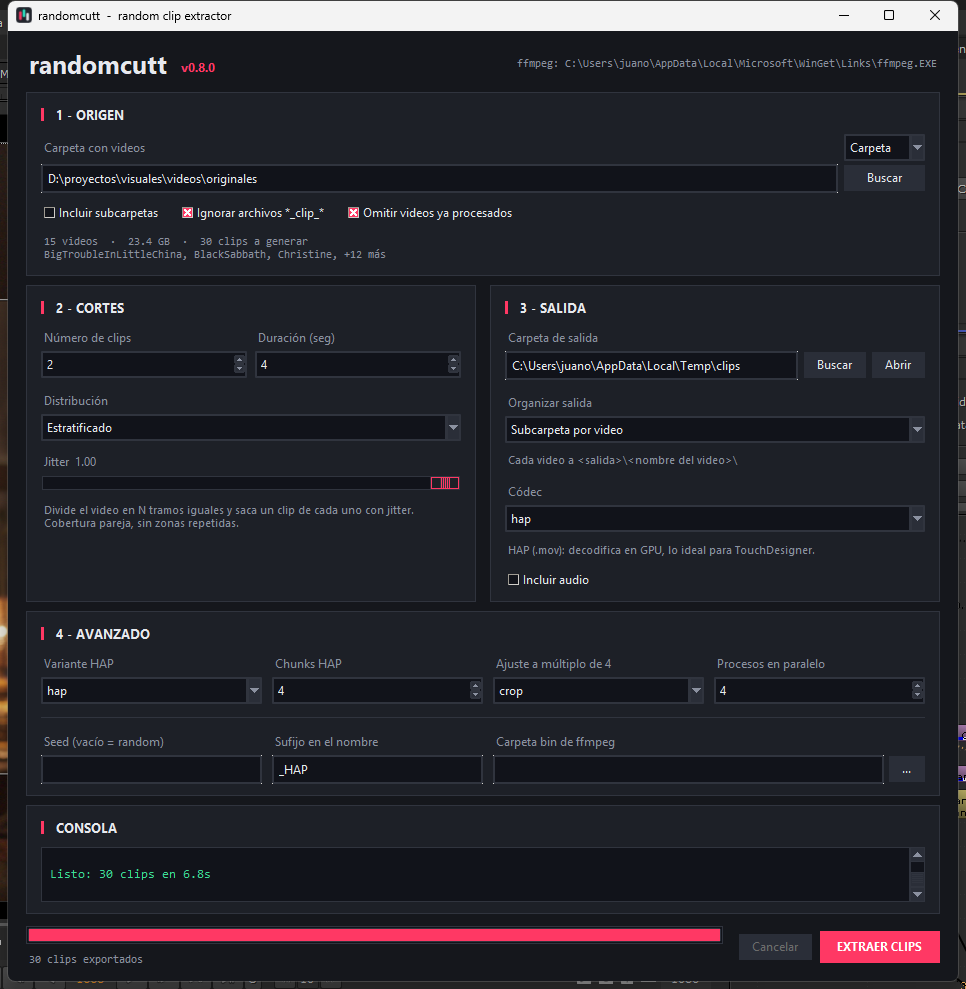

# randomcutt

Extractor de clips aleatorios para VJ. Le das un video largo, le indicas cuántos
clips quieres y de qué duración, y genera N recortes desde puntos al azar,
exportados en **HAP** para que **TouchDesigner** los decodifique en GPU.

Nació para alimentar un cutter de visuales con material corto y desordenado.
Hace una sola cosa y la hace rápido.



---

## Qué hace

- Lee la duración real del video con `ffprobe` y elige N puntos de inicio.
- Corta con `ffmpeg` usando *input seek* (`-ss` antes de `-i`): salta al punto
  sin decodificar todo lo anterior, así que el tiempo no depende de cuán
  adentro del video caiga el corte.
- Exporta en HAP, ProRes, H.264 (CPU o NVENC) o copia el stream sin recomprimir.
- Ejecuta varios `ffmpeg` en paralelo.

## Requisitos

**`ffmpeg` y `ffprobe` en el PATH.** Es lo único. En Windows:

```powershell
winget install Gyan.FFmpeg
```

La app los busca sola (PATH, `C:\Program Files\ffmpeg\bin`, el paquete de
WinGet, o junto al `.exe`). Si los tienes en otra ubicación, indica la carpeta
`bin` en el campo *Carpeta bin de ffmpeg* de la sección AVANZADO.

Para ejecutarlo desde el código en vez del `.exe`: Python 3.9+ con `tkinter`.
No hay dependencias externas.

```bash
python randomcutt_v007.py
```

## Uso

1. **ORIGEN** — elige un video (`Archivo`) o una carpeta entera (`Carpeta`).
2. **CORTES** — cuántos clips y de cuántos segundos (acepta decimales: `0.5`).
3. **SALIDA** — carpeta destino, cómo organizarla y códec.
4. **EXTRAER CLIPS**.

Los archivos salen como `<nombre>_clip_<n>.mov`. Nunca sobrescribe nada: si el
nombre existe, agrega `_1`, `_2`, etc.

### Modo carpeta (lote)

Eliges una carpeta con películas y saca N clips de **cada una**. Con
*Organizar salida* en `Subcarpeta por video`, cada película termina en su propia
carpeta:

```
originales\                         salida\
  NinjaScroll.mkv          →          NinjaScroll\
  Suspiria.mp4                          NinjaScroll_clip_1_HAP.mov
  WickedCity.mkv                        NinjaScroll_clip_2_HAP.mov
                                      Suspiria\
                                        Suspiria_clip_1_HAP.mov
                                        ...
```

Antes de empezar muestra cuántos videos encontró, cuánto pesan y cuántos clips
va a generar.

| Opción | Qué hace |
|--------|----------|
| **Incluir subcarpetas** | Busca videos también dentro de las subcarpetas. Desactivado por defecto. |
| **Ignorar archivos `*_clip_*`** | No usa como fuente lo que ya parece un clip generado. Importa si la carpeta mezcla fuentes y clips. |
| **Omitir videos ya procesados** | Si la carpeta de salida de un video ya tiene clips suyos, lo omite. Puedes detener un lote a la mitad, volver a lanzarlo y continúa donde quedó. |

También descarta sidecars de macOS (`._nombre.mkv`) y archivos de menos de
64 KB. Si un video está roto o no se puede leer, lo reporta y sigue con el
resto — un archivo malo no frena el lote.

Con **Seed** el lote entero es reproducible, pero cada película recibe su propia
tirada (el seed se combina con el nombre del archivo).

| Organizar salida | Resultado |
|------------------|-----------|
| **Subcarpeta por video** | `<salida>\<nombre del video>\` — opción por defecto. |
| **Todo en una carpeta** | Todos los clips sueltos en `<salida>\`. |
| **Junto al video de origen** | Al lado de cada fuente. Ignora la carpeta de salida. |

Medido sobre 15 películas reales (23.4 GB: h264, hevc, av1 y mpeg4 en
mp4/mkv/avi), 3 clips de 3s por película a HAP: **45 clips en 8.7 s**.

### Distribución de los cortes

| Modo | Qué hace |
|------|----------|
| **Random puro** | Puntos de inicio totalmente al azar. Puede repetir o solapar zonas. |
| **Estratificado** | Divide el video en N tramos iguales y saca un clip de cada uno, con jitter regulable. Cobertura pareja de todo el video, sin repetir. |
| **Lineal** | Intervalos exactos y regulares. Cero azar. |

El campo **Seed** hace la tirada reproducible: mismo seed + mismo video +
mismos parámetros = exactamente los mismos cortes.

### Códecs

| Códec | Contenedor | Para qué |
|-------|-----------|----------|
| `hap` | `.mov` | **Por defecto.** Decodifica en GPU. Lo ideal para `moviefilein` en TouchDesigner. |
| `prores_ks` | `.mov` | ProRes HQ. Decodifica en CPU. |
| `libx264` | `.mp4` | CRF 18, yuv420p. Liviano en disco. |
| `h264_nvenc` | `.mp4` | H.264 por GPU (NVIDIA). El más rápido de exportar. |
| `copy` | igual que el origen | Sin recomprimir. Solo corta en keyframes, la duración real puede variar. |

**Variantes HAP:** `hap` (DXT1, el más liviano), `hap_q` (mejor calidad, ~70%
más pesado), `hap_alpha` (con canal alpha).

**Chunks:** parte cada frame en N bloques para que el decoder los descomprima en
paralelo. 4 funciona bien. Súbelo si reproduces varios streams a la vez.

> **HAP exige ancho y alto múltiplos de 4.** Si tu fuente no lo es `ffmpeg`
> aborta. Pasa más de lo que parece: material de DVD (654×480, 638×480) y también
> rips de 1080 con las barras recortadas (1920×1038). En una biblioteca real de
> 15 películas, 3 caían en esto. randomcutt lo detecta y recorta al múltiplo más
> cercano: pierdes 1–3 px del borde derecho e inferior. Puedes cambiarlo a `pad`
> (barras negras) en AVANZADO.

### Procesos en paralelo

Cuántos `ffmpeg` corren a la vez. Medido en un Ryzen 9 7900X, 24 clips de 5s a
HAP desde una fuente H.264 654×480:

| Procesos | Tiempo |
|----------|--------|
| 1 | 4.3 s |
| 3 | 2.3 s |
| 6 | 1.7 s |
| 12 | 1.5 s |

Rinde hasta ~6; por encima, el cuello de botella pasa a ser el disco. El valor
por defecto es 3.

## Compilar el ejecutable

```powershell
powershell -ExecutionPolicy Bypass -File build_exe.ps1
```

Crea un venv aislado en `.venv-build`, instala PyInstaller ahí y deja
`dist\randomcutt.exe` (~12 MB). No toca tu Python base. `-Clean` borra todo y
empieza de cero.

`ffmpeg` **no** se empaqueta (son 200 MB); la app lo busca al arrancar. Si
quieres una versión totalmente portable, copia `ffmpeg.exe` y `ffprobe.exe` al
lado del `.exe` y los encontrará.

> Si compilas con un Python de Anaconda/Miniconda, el script agrega
> `Library\bin` al PATH antes de invocar PyInstaller. Sin eso `tcl86t.dll` y
> `tk86t.dll` no se empaquetan y el `.exe` muere con
> `ImportError: DLL load failed while importing _tkinter`.

## Configuración

Los parámetros se guardan al cerrar en
`%LOCALAPPDATA%\randomcutt\config.json` y se restauran al abrir.

## Licencia

MIT — ver [LICENSE](LICENSE).
